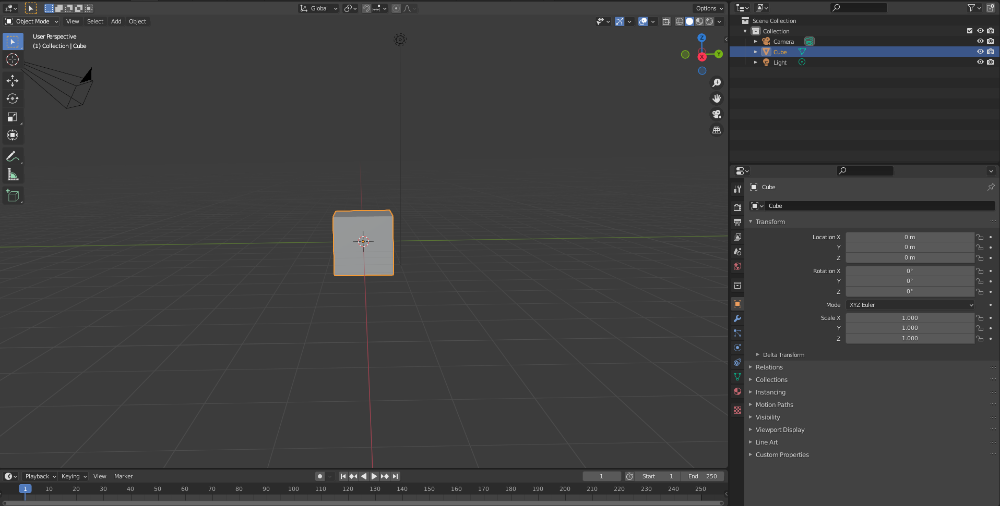
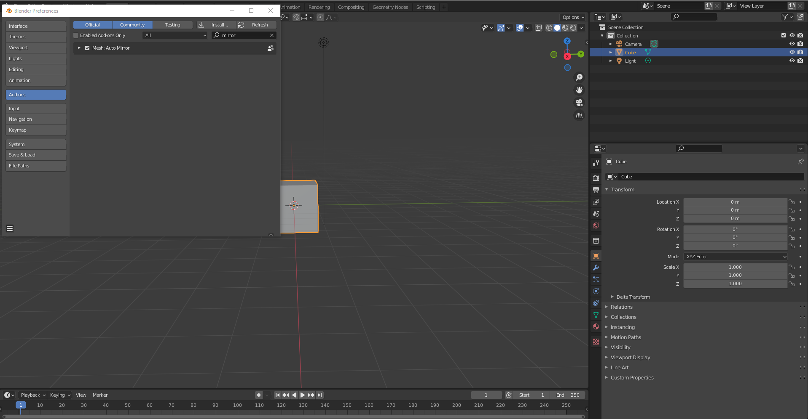
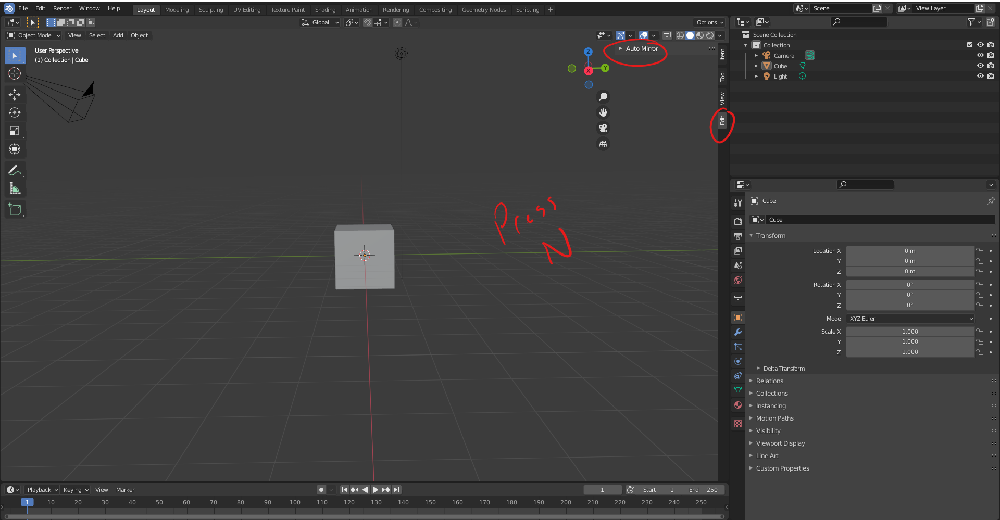
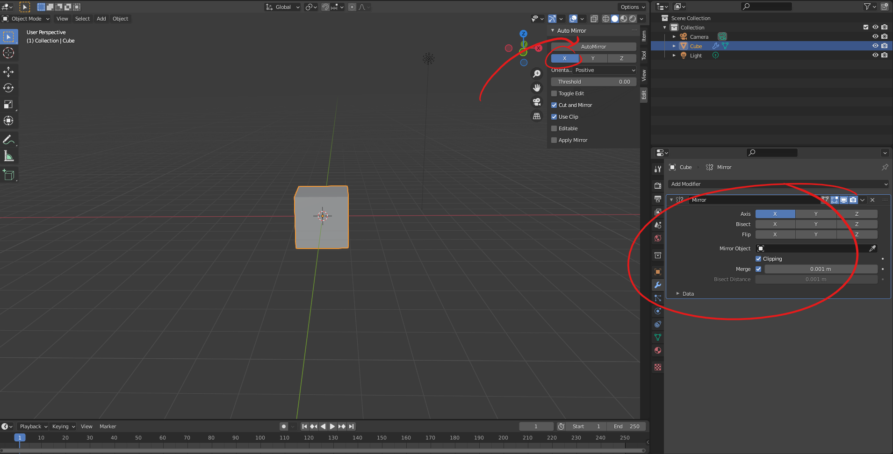

# DEV-01, Mech Master - Creating The Cockpit
#### Tags: [mirror]

## Getting mirror plugin

    I am mirroring an object. Instead of using the mirror modifier, we can use a plugin to do it

## Step 1

    Under Edit > Preferences, go to add ons

## Step 2

    Verify with N > Edit

## Step 3

    Select Auto Mirror  

