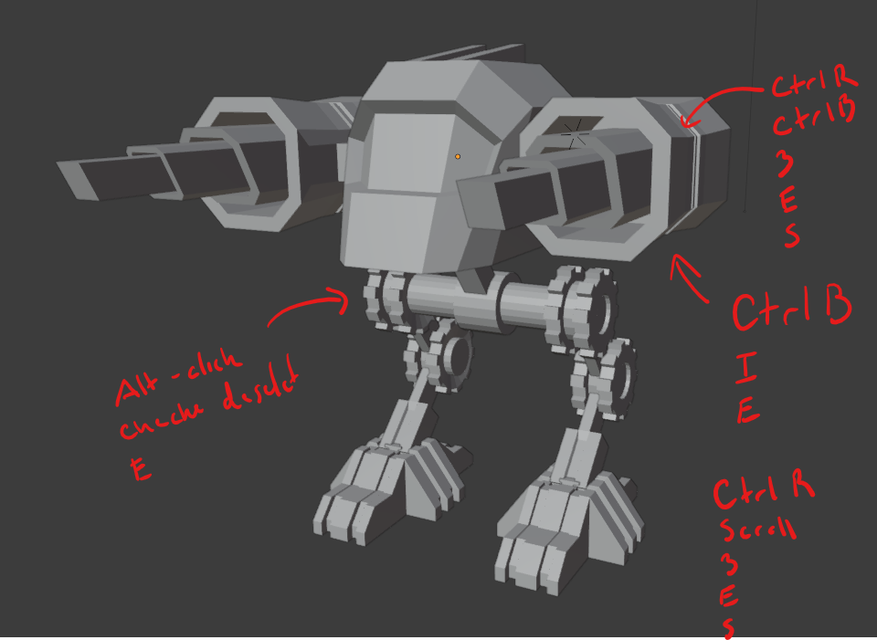
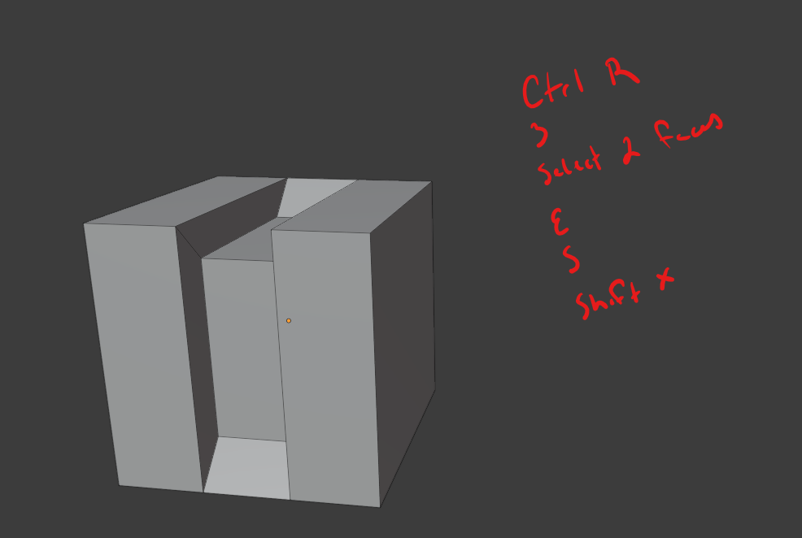
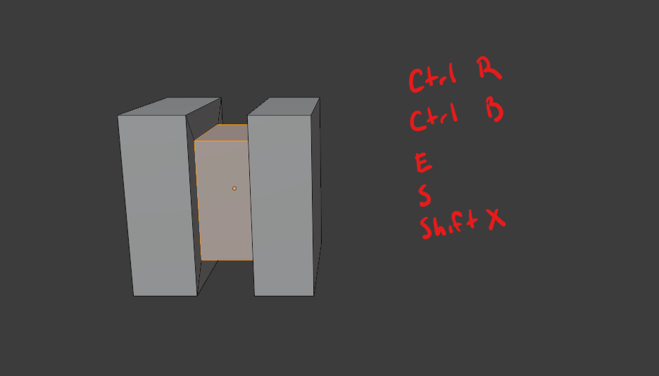
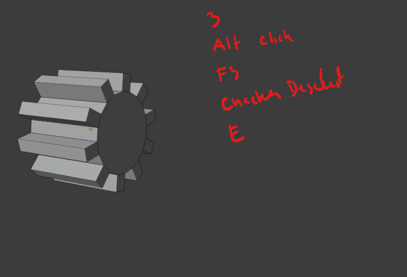

# DEV-02, creating weapons
#### Tags: [bevel, loop cuts, scaling]

## Step break down of some pieces

## interesting techniques

    Ctrl + 
    Ctrl -

    1 or 3 then
    Shift Ctrl Alt S (Shearing)

    Press E to toggle evenness for loop cuts

