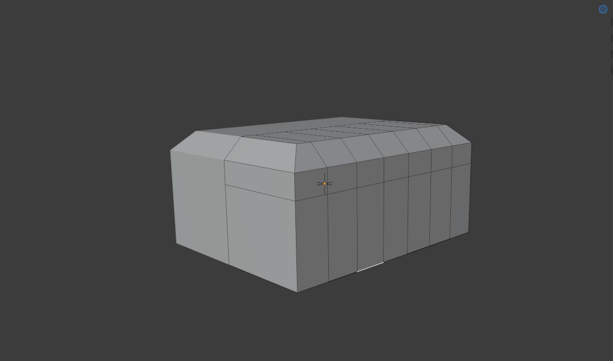
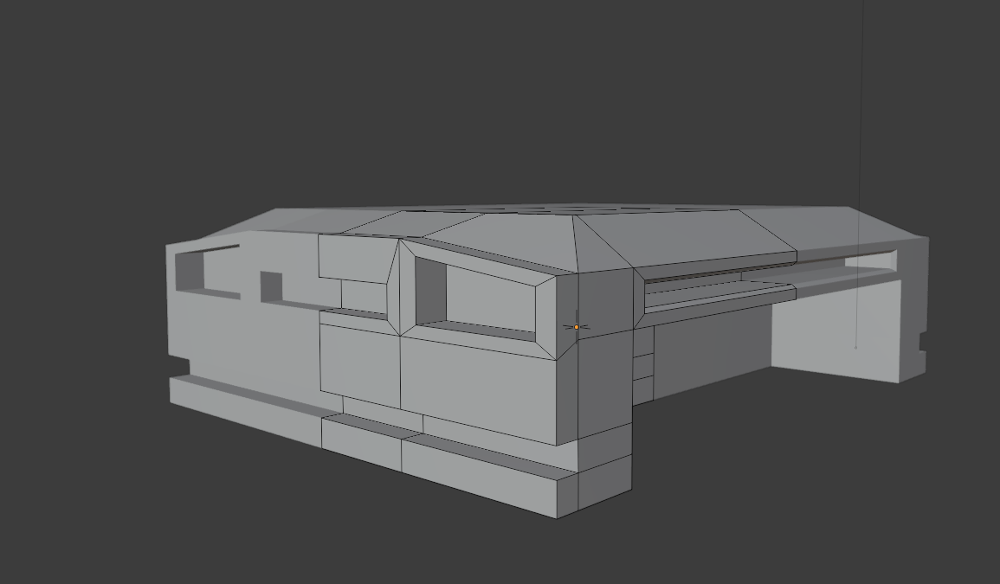
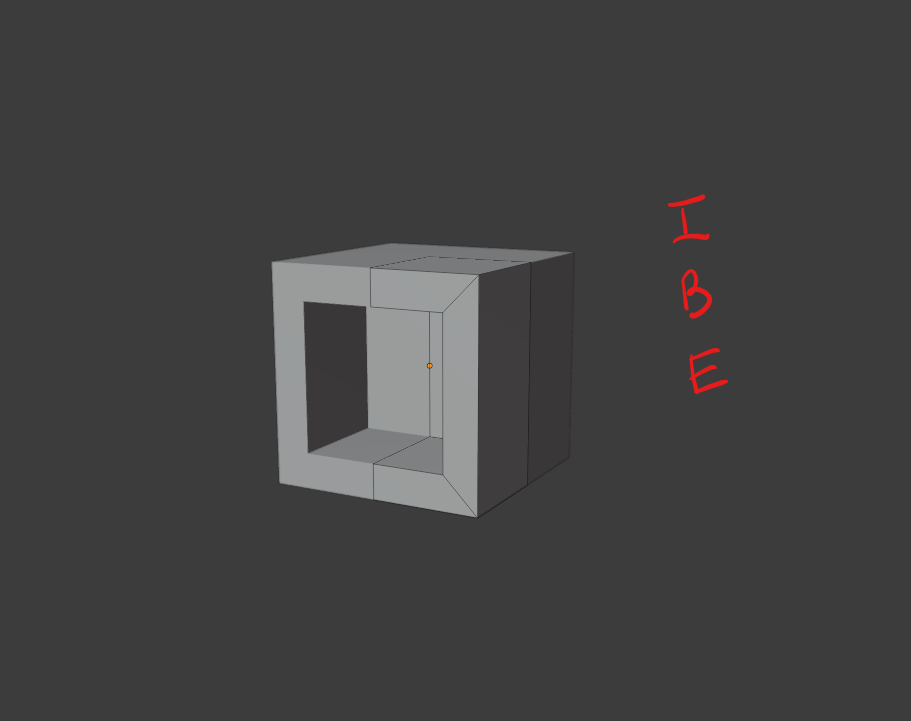
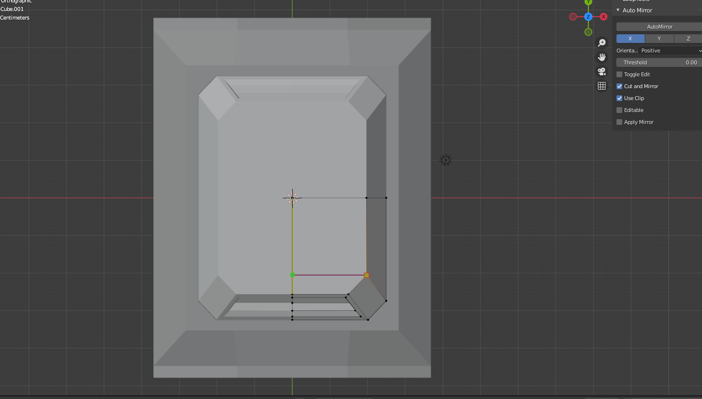
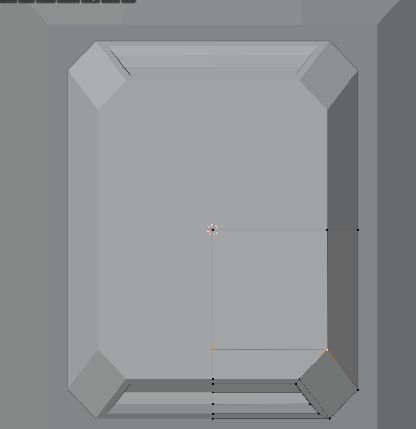
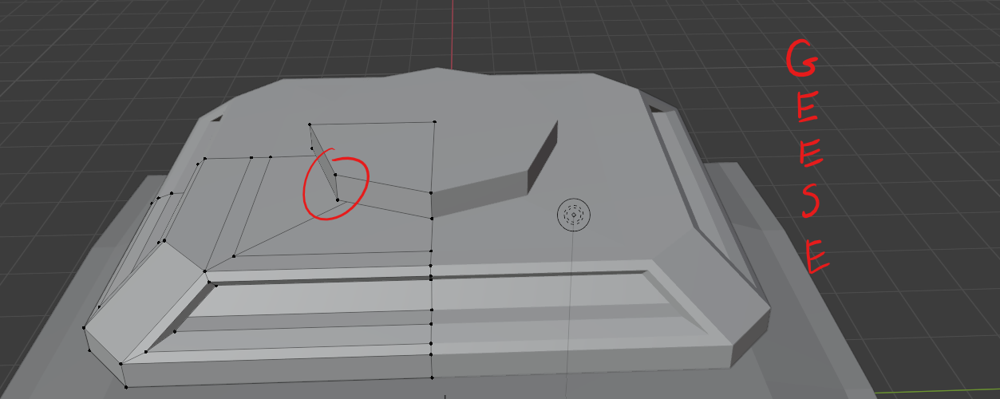

# DEV-04,
#### Tags: [insetting, mirroring]

## interesting techniques

    N-Gons are okay for flat surfaces but once they go beyon that, they render badly. if you need to make an n-gon a quad, use Ctrl-K

