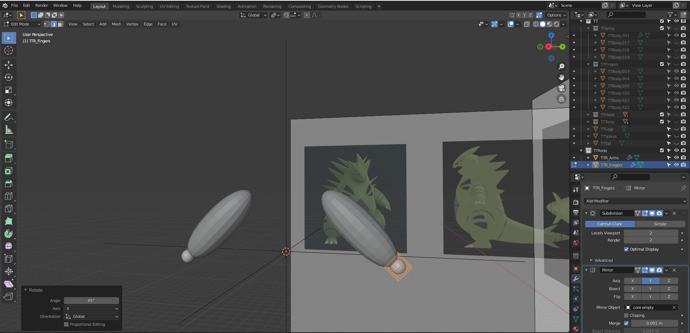
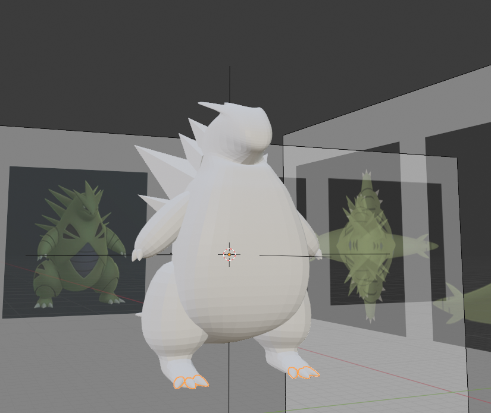

# DEV-12, Creating Tyranitar
#### Tags: [subdivisions, sculpting]

## References

## Blocking out (failed attempted that we learned from)

    This looks too ugly to work

## Blocking out with Subdivision modifier (Restart)

    Sub division modifier is ver useful, heres a hammer:

## Sculpting

    Im going to use the tool Duyen Toppo
    One limitation is that mirror modifier is not supported in its use along with it.
    Therefore I'll need to apply all my mirror mods at this point.

    Apply all modifiers at once

    Before I start sculpting, I need to make sure that the orgin for things like the leg and arms are consistent and are at the empty origin

